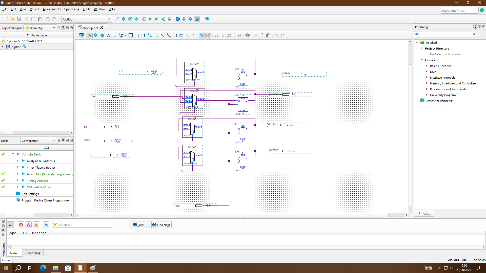
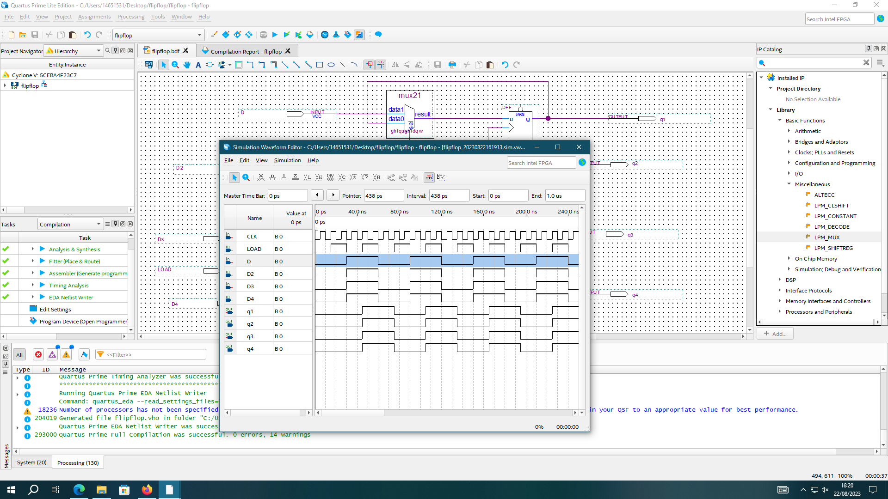
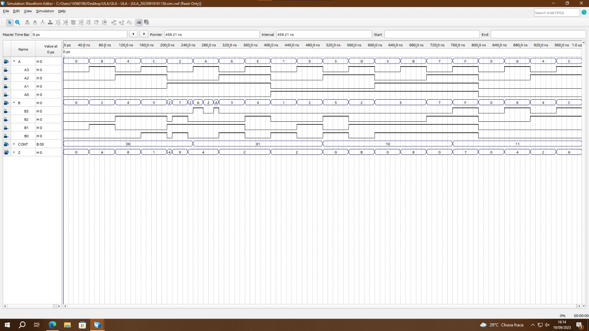
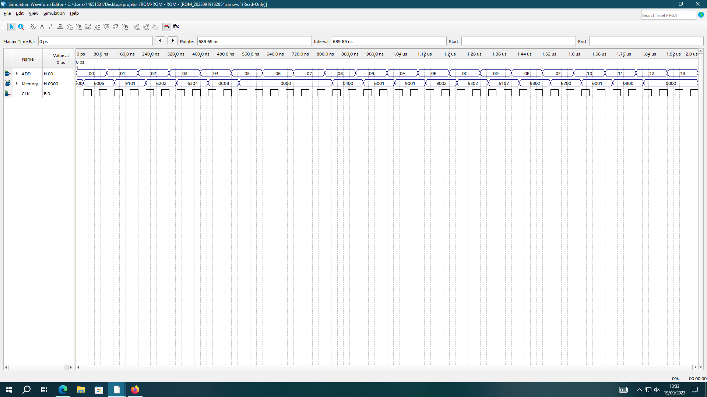
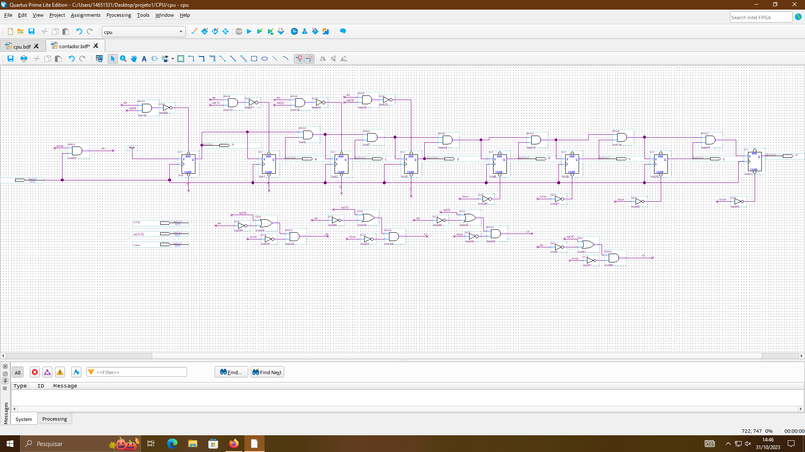
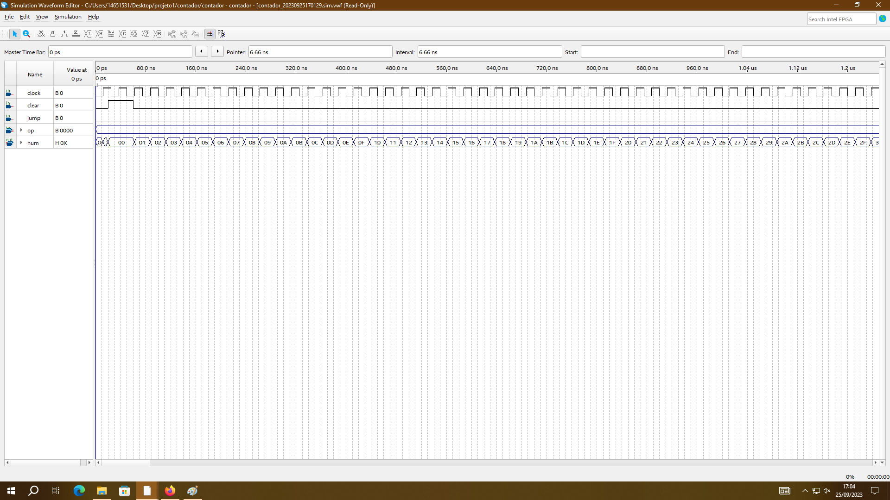
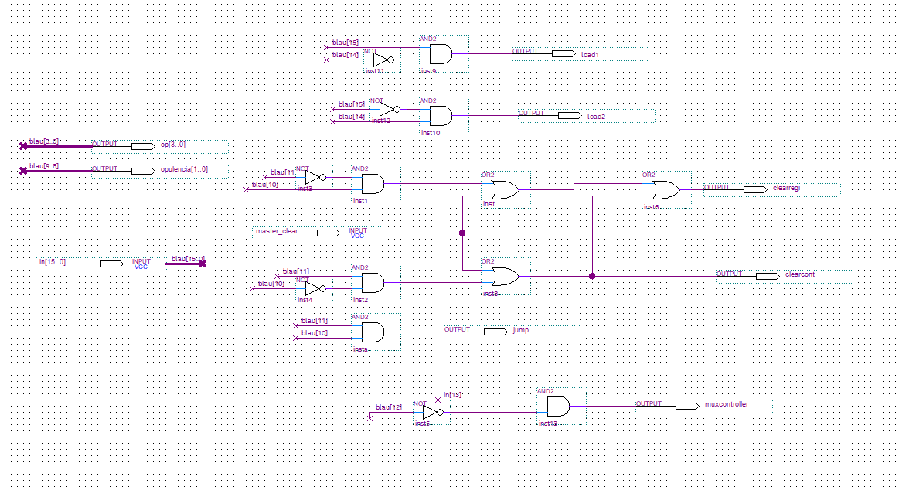
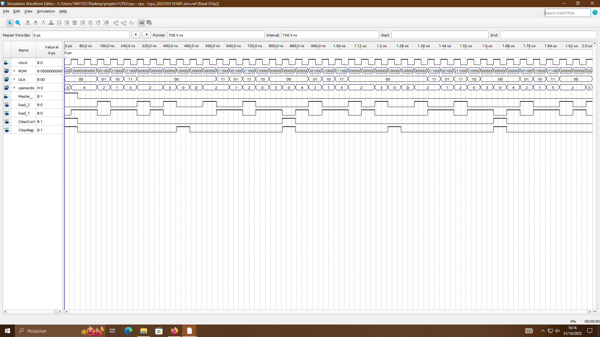
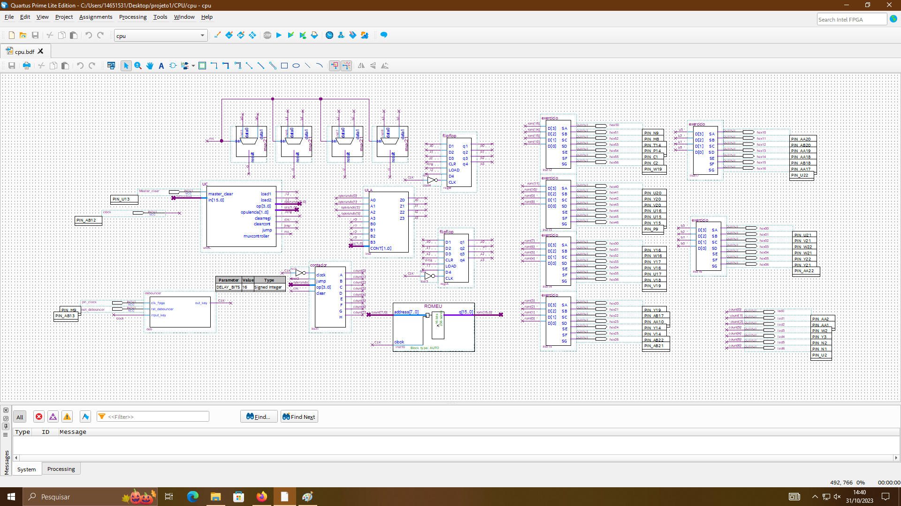
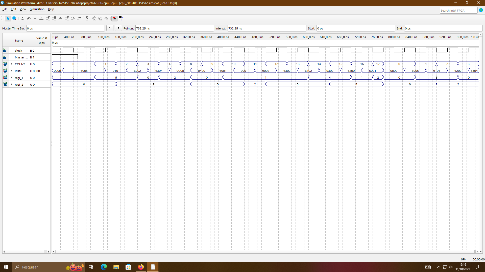

# Digital Systems CPU Project in Quartus

**UNIVERSITY OF SÃO PAULO**  
**INSTITUTE OF MATHEMATICAL AND COMPUTER SCIENCE**

Augusto Cavalcante Barbosa Pereira – 14651531  
Ayrton da Costa Ganem Filho – 14560190  
Felipe Volkweis de Oliveira - 14570041  

CPU Work Report - Digital Systems  
Professor Danilo H. Spatti  
São Carlos SP  
11/06/2023

## Table of Contents

1. [INTRODUCTION](#1-introduction)
2. [CPU COMPONENTS](#2-cpu-components)
   1. [Register](#21-register)
   2. [ALU](#22-alu)
   3. [ROM](#23-rom)
   4. [Counter](#24-counter)
   5. [Control Unit](#25-control-unit)
3. [CPU](#3-cpu)

## 1. Introduction

The CPU (central processing unit) is the central processing unit of the computer. It is composed of an 8-bit counter, a ROM, a control unit, an ALU (arithmetic logic unit), and two registers, all associated with a clock.

In the implementation of this project, the clock was applied on the falling edge in the ROM, while on the rising edge was the counter and the registers.

## 2. CPU Components

### 2.1 Register

A register is formed by a set of flip flops. In the case of the work, a 4-bit parallel load register was used.

### 2.2 ALU

Another part of the CPU is the ALU which performs the operations of addition, subtraction, division, and multiplication by 2.

In this case, CONT denotes the ALU operations: 00 is the sum between A and B, 01 is the subtraction between A and B, 10 is the multiplication of A by 2, 11 is the division of A by 2.

### 2.3 ROM

The next step is the ROM (Read Only Memory). It is responsible for sending the commands to the control unit.

### 2.4 Counter

Another component of the CPU is the counter, which was used a synchronous 8-bit counter. Its function is to inform at which memory address the CPU is to execute.

### 2.5 Control Unit

Another important component of the CPU is the Control Unit. It serves to administer all the processes of the CPU (jump, load, etc.).

## 3. CPU

Thus, using the previously discussed components, we built the CPU presented below.

